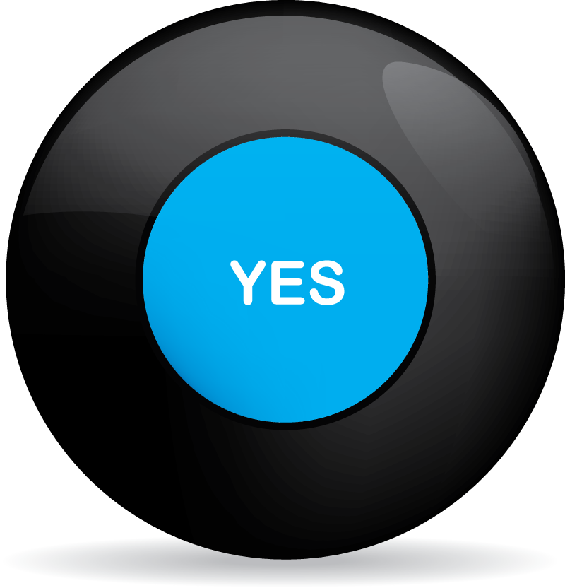
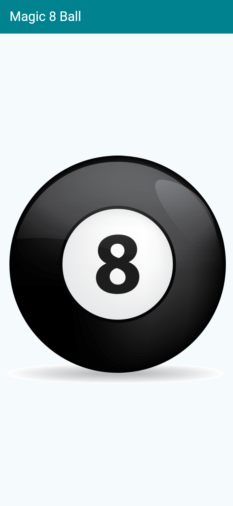
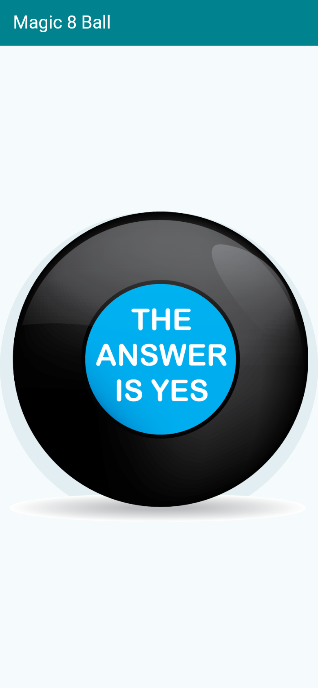

<div align="center">

# 🔮 Magic 8 Ball

**Ask a question, tap the ball — get one of six classic answers.**



[](https://flutter.dev)
[](https://dart.dev)
[](LICENSE)

</div>

---

## 📲 Try it · امتحانش کنید

| 🌐 **Live demo** · دموی آنلاین | **[ParsaFathii.github.io/magic_8_ball](https://ParsaFathii.github.io/magic_8_ball/)** — runs right in the browser, no install needed · مستقیم در مرورگر اجرا می‌شود، بدون نصب |
| 🤖 **Android APK** · نسخهٔ اندروید | **[Latest release](https://github.com/ParsaFathii/magic_8_ball/releases/latest)** — download `app-release.apk` · فایل `app-release.apk` را دانلود کنید |

---

## 📸 Screenshots · اسکرین‌شات‌ها

<p align="center">
  
  
</p>

---

## 🇬🇧 English

The fortune-telling toy from my early Flutter days: tap the 8-ball and it cycles through six classic answers ("Yes definitely", "Ask again later", …). A simple state machine — `int ballNumber` drives which image is shown, exactly like the dice app but with a single state variable.

While revisiting the code I also fixed a real layout bug: the ball was originally wrapped in an `Expanded` directly inside a `Center`. `Expanded` only makes sense inside a `Flex` (`Row`/`Column`), so that structure was invalid and produced layout errors. The fixed version centers the ball correctly with a plain `Center > TextButton`.

### ✨ What's inside

| Concept | Where it lives |
|---|---|
| `StatefulWidget` with a single state variable | `lib/main.dart` |
| `Random` answer selection | `lib/main.dart` |
| **Bug fix:** invalid `Expanded`-inside-`Center` removed | `lib/main.dart` |
| A smoke test that "shakes" the ball | `test/widget_test.dart` |

### 🚀 Run it

```bash
flutter pub get
flutter run
```

### 🧪 Test it

```bash
flutter test
```

---

## 🇮🇷 فارسی

اسباب‌بازی فال‌گیری از روزهای اول Flutter من: توپ جادویی هشت را لمس کنید تا بین شش جواب کلاسیک («قطعاً بله»، «بعداً بپرس» و…) یکی را نشان دهد. یک ماشین حالت ساده — متغیر `ballNumber` مشخص می‌کند کدام تصویر نمایش داده شود، درست مثل اپ تاس اما با فقط یک متغیر وضعیت.

در بازبینی کد، یک باگ واقعی چیدمان هم رفع شد: تصویر توپ در نسخهٔ اولیه داخل `Expanded` قرار داشت که مستقیماً زیر `Center` بود. `Expanded` فقط داخل `Row` یا `Column` معنا دارد و آن ساختار نامعتبر بود و خطای چیدمان تولید می‌کرد. نسخهٔ اصلاح‌شده توپ را با `Center > TextButton` به‌درستی وسط‌چین می‌کند.

### ✨ چه چیزهایی در آن هست

| مفهوم | محل استفاده |
|---|---|
| `StatefulWidget` با یک متغیر وضعیت | `lib/main.dart` |
| انتخاب جواب تصادفی | `lib/main.dart` |
| **رفع باگ:** حذف `Expanded` نامعتبر داخل `Center` | `lib/main.dart` |
| تست اسموک با «تکان دادن» توپ | `test/widget_test.dart` |

### 🚀 اجرا

```bash
flutter pub get
flutter run
```

---

<div align="center">

**Built with Flutter · Maintained by [Parsa Fathi](https://github.com/ParsaFathii)**

</div>
